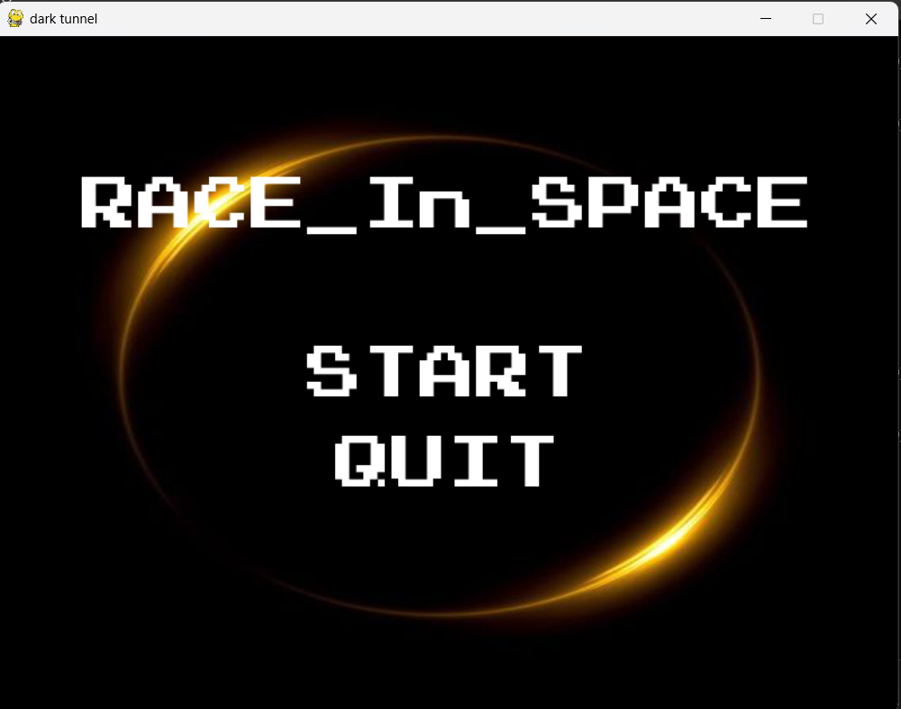
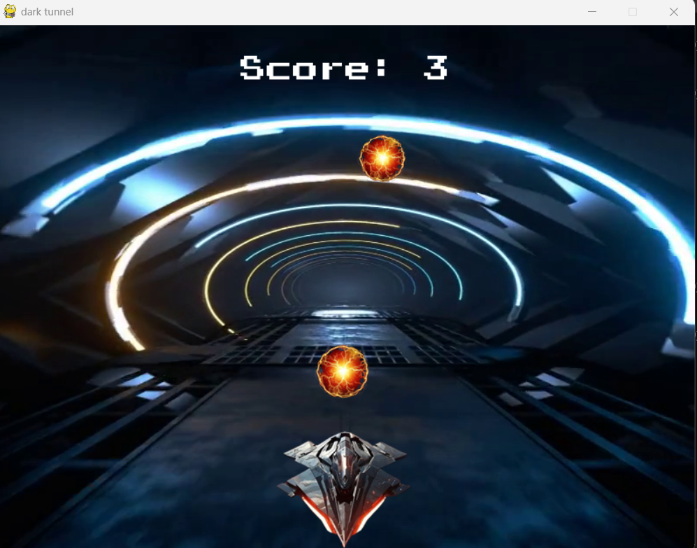
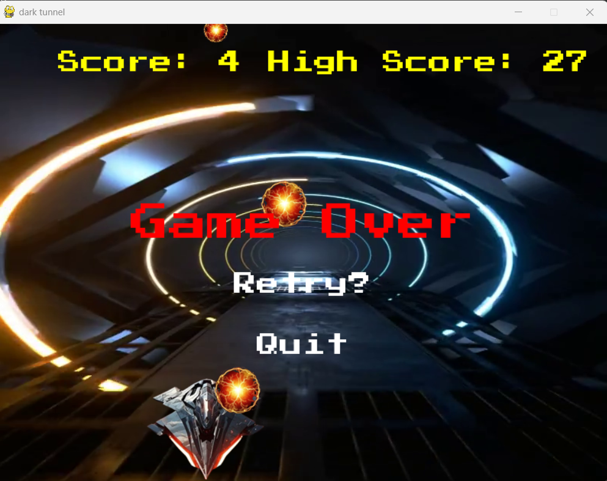

# 🚀 Race In Space

**Race In Space** is a simple yet exciting 2D endless runner game made using **Python** and **Pygame**. The goal is to dodge obstacles and survive for as long as you can inside a fast-moving space tunnel. It's fast, fun, with cool visuals, immersive music and a fun arcade experience!

## 🎮 What’s Inside
- A clean and classic home screen
- Control your spaceship with arrow keys to dodge unpredictable obstacles (they change direction mid-way — stay sharp!)
- Continuously scrolling background to simulate racing through a space tunnel.
- A high score tracker to keep you motivated
- Cool, non-copyrighted space background music
- A clean end-game screen when it’s game over

## 🛠 Built With
- Python 3
- Pygame

## ▶️ How to Play
1. Make sure Python and Pygame are installed on your system.
2. Clone this repository:
    ```
    git clone https://github.com/PareekJahanvee/Race_In_Space.git
    ```
3. Move into the project folder, open Command Prompt or PowerShell, and run the game:
    ```
    python endgame.py
    ```

## 📂 Project Structure
- `assets/` – Images, sounds, and other game assets
- `endgame.py` – Main game logic
- `high_score.txt` – Stores your highest score

## 📸 Screenshots
- 
- 
- 

## 📄 License
This project is licensed under the MIT License – feel free to use or modify it.

## ⚠️ Disclaimer
The character and obstacle images used in this game are placeholders sourced from the internet and are not owned by the developer. They are used strictly for non-commercial, educational, and demonstrative purposes only. All rights belong to their respective creators.

---

Hope you enjoy playing **Race In Space** as much as I enjoyed building it! 🌌✨
